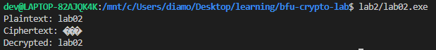

# Лабораторная работа №2
___
## Объяснение
___

1) Генерация ключа и iv
```c++
    void KeyGen(SecByteBlock& key, SecByteBlock& iv)
```
2) Шифрование при помощи алгоритма блочного шифрования AES в режиме счётчика.
```c++
    void Enc(SecByteBlock& key, SecByteBlock& iv, std::string& plaintext, std::string& ciphertext)
```
3) Дешифрование при помощи алгоритм блочного шифрования AES в режиме счётчика.
```c++
    void Dec(SecByteBlock& key, SecByteBlock& iv, std::string& ciphertext, std::string& decrypted)
```
___
## Результат
___
