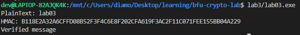
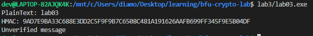

# Лабораторная работа №3
___
## Объяснение
___

1) Генерация ключа
```c++
    void KeyGen(SecByteBlock& key)
```
2) В методе Sign производятся необходимые действия по подписи сообщения.
```c++
    void Sign(SecByteBlock& key, std::string& plaintext, std::string& mac, std::string& hmacText)
```
3) Производится верификация, возвращает true или false.
```c++
    bool Verify(SecByteBlock& key, std::string& plainText, std::string& mac)
```
___
## Результат
___
Верификация пройдена



Добавим код после вывода HMAC
```c++
    mac[0] = 'x';
```

То получим результат с непройденой верификацией
