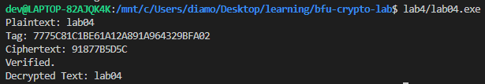

# Лабораторная работа №4
___
## Объяснение
___
Использование алгоритма GCM(Galious/Counter Mode)
1) Генерация ключа
```c++
    void KeyGen(SecByteBlock& key, SecByteBlock& iv)
```
2) В методе EncAndSign производится шифрование и подпись текста, дополнительно используется "Дополнительные данные аутентификации"(aad).
```c++
    void EncAndSign(SecByteBlock& key, SecByteBlock& iv, std::string& plaintext, std::string& aad, std::string& ciphertext, std::string& tag)
```
3) Производится расшифрока и верификация, возвращает true или false.
```c++
    bool DecAndVerify(SecByteBlock& key, SecByteBlock& iv, std::string& ciphertext, std::string& tag, std::string& aad, std::string& decrypted)
```
___
## Результат
___
