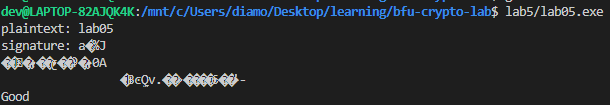

# Лабораторная работа №5
___
## Объяснение
___
Использование алгоритма GCM(Galious/Counter Mode)
1) Генерация ключа публичного и секретного
```c++
    void KeyGen(ECDSA<ECP, SHA256>::PrivateKey& privateKey, ECDSA<ECP, SHA256>::PublicKey& publicKey)
```
2) Подпись секретного ключа
```c++
    void Sign(ECDSA<ECP, SHA256>::PrivateKey& privateKey, string& plaintext, string& signature)
```
3) Верификация публичного ключа
```c++
    void Verify(PublicKey& publicKey, string& plaintext, string& signature)
```
___
## Результат
___
